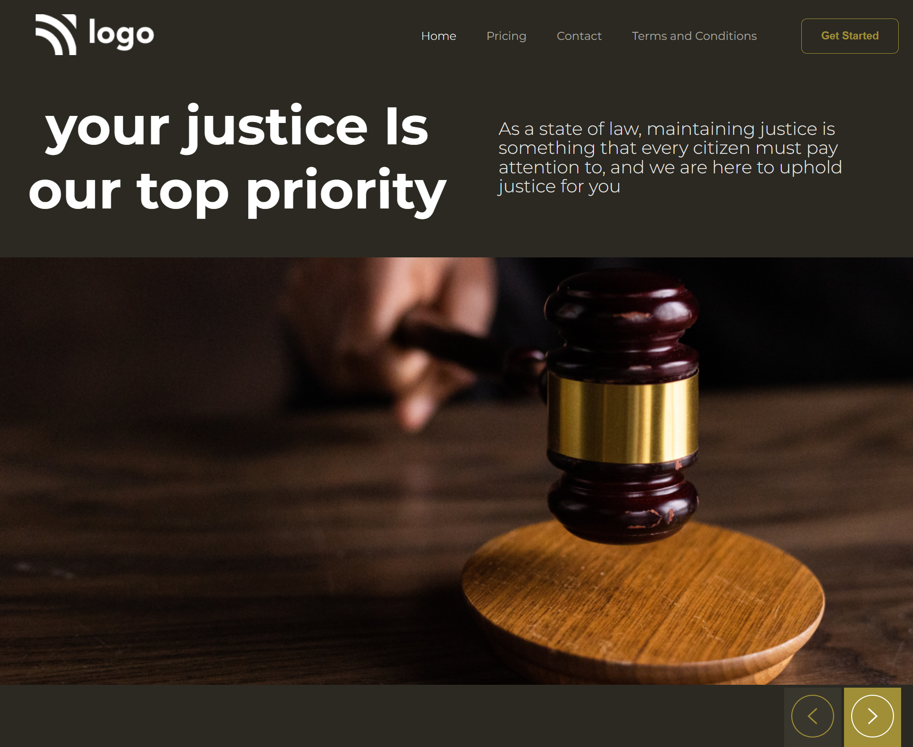

# Project | Justice  

_by Tasmiya 💗_

### 🔗*Live Link* -: [Justice](https://tasmiya-proj-3.netlify.app)

## Technologies used

- HTML
- CSS

## 💡 What I have learn ?

- I learned about positioning around the webpage.
- I learned how to add background and position them accordingly.
- I learned how to design Buttons and Navbar.
- I learned how to use margin and padding.

## This project took around 2 hours to complete 😊.

